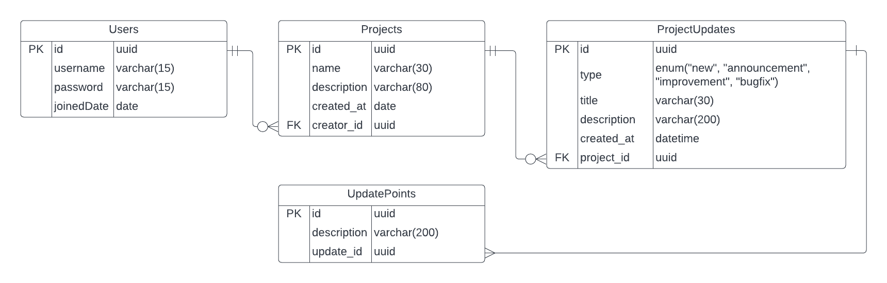

<a name="readme-top"></a>
<!-- TABLE OF CONTENTS -->
<details>
  <summary>Table of Contents</summary>
  <ol>
    <li>
      <a href="#about-the-project">About The Project</a>
      <ul>
        <li><a href="#user-stories">User Stories</a></li>
        <li><a href="#entity-relationship-diagram">Entity Relationship Diagram</a></li>
        <li><a href="#built-with">Built With</a></li>
      </ul>
    </li>
    <li>
      <a href="#getting-started">Getting Started</a>
      <ul>
        <li><a href="#prerequisites">Prerequisites</a></li>
        <li><a href="#installation">Installation</a></li>
      </ul>
    </li>
  </ol>
</details>


<!-- ABOUT THE PROJECT -->
## About The Project

This app allows a product manager or engineer to post projects/products updates for the team to see. This helps the team to keep track of the timelines of each one of them and show the stakeholders the progress made.

<p align="right">(<a href="#readme-top">back to top</a>)</p>

### User Stories
For planning purposes, the project is divided into User Stories which according to Martin Fowler are "chunks of desired behavior of a software system". They help prioritize work and identify the business value of each of the features to be developed.

1. _As a user I want to create, update and delete projects to carry out the recording of progress and so that other users can access them_.
  * Related issues: #4, #9, #7, #11, #12

2. _As a user I want to see a list of all projects in the main page of the app so that I can select them and access their details_.
  * Related issues: #10

3. _As a user I want to post project updates so that the team and stakeholders can see the progress made_.
  * Related issues: #17, #18, #24

4. _As a user I want to filter projects by name, date of publication or creator so that I can quickly find the project that I am looking for_.
  * Related issues: #13, #14, #15

5. _As a user I want to paginate over the list of all projects so that I can easily go through them without looking at a lot of information at once_.
  * Related issues: #16

6. _As a user I want to authenticate myself so that I can access all the functionalities of the app_.
  * Related issues: #23, #21, #20, #19, #22

<p align="right">(<a href="#readme-top">back to top</a>)</p>

### Entity Relationship Diagram
The interactions between business entities can be describe in an ERD. It is very simple but serves its illustration purpose.


<p align="right">(<a href="#readme-top">back to top</a>)</p>

### Built With
This project was built with a very similar tech-stack to the one used by `oldboyxx` in his [`Jira Clone`](https://github.com/oldboyxx/jira_clone) project. It is very stable and easy to understand, so development is well-organized and fluid.

* [![JavaScript][JavaScript]][JavaScript-url]
* [![TypeScript][TypeScript]][TypeScript-url]
* [![React][React.js]][React-url]
* [![Express][Express]][Express-url]
* [![NodeJS][NodeJS]][NodeJS-url]
* [![Postgres][Postgres]][Postgres-url]
* [![Netlify][Netlify]][Netlify-url]
* [![Heroku][Heroku]][Heroku-url]

<p align="right">(<a href="#readme-top">back to top</a>)</p>

<!-- GETTING STARTED -->
## Getting Started

These are the instructions on setting up the project locally.

### Prerequisites

* Node

  For development I used Node version 18. Therefore I suggest you use that as well.
  ```sh
  node --version
  ```

  There are different ways of managing Node version, however, I recommend [`nvm`](https://github.com/nvm-sh/nvm).
  ```sh
  nvm use 16.14.0
  ```

* Package Manager (Yarn)

  Even though `npm` is very famous, I've had really good experiences with [`yarn`](https://yarnpkg.com/).

<p align="right">(<a href="#readme-top">back to top</a>)</p>

### Installation

1. Install [PostgreSQL](https://www.postgresql.org/) if you don't have it already and create a database named `change_log_app`.
2. From terminal run the following commands:
    - `git clone git@github.com:CarlosCRG19/change-log-app.git` - clone the repo in case you don't have it
    - `cd change-log-app`
    - `cd client/ && yarn install` - enter the client (front-end) folder and install packages
    - `cd ../server/ && yarn install` - enter the server (back-end) folder and install packages
    - `cd ../ && yarn install` - return to the main folder and install packages
    - `yarn start:dev` - start project
3. App should now be running on `http://localhost:5173` and server should be on `http://localhost:3000`

<p align="right">(<a href="#readme-top">back to top</a>)</p>

<!-- MARKDOWN LINKS & IMAGES -->
[JavaScript]: https://img.shields.io/badge/javascript-%23323330.svg?style=for-the-badge&logo=javascript&logoColor=%23F7DF1E
[JavaScript-url]: https://developer.mozilla.org/es/docs/Web/JavaScript
[React.js]: https://img.shields.io/badge/React-20232A?style=for-the-badge&logo=react&logoColor=61DAFB
[React-url]: https://reactjs.org/
[TypeScript]: https://img.shields.io/badge/typescript-%23007ACC.svg?style=for-the-badge&logo=typescript&logoColor=white
[TypeScript-url]: https://www.typescriptlang.org/
[Express]: https://img.shields.io/badge/express.js-%23404d59.svg?style=for-the-badge&logo=express&logoColor=%2361DAFB
[Express-url]: https://expressjs.com/
[NodeJS]: https://img.shields.io/badge/node.js-6DA55F?style=for-the-badge&logo=node.js&logoColor=white
[NodeJS-url]: https://nodejs.org/en/
[Postgres]: https://img.shields.io/badge/postgres-%23316192.svg?style=for-the-badge&logo=postgresql&logoColor=white
[Postgres-url]: https://www.postgresql.org/
[Netlify]: https://img.shields.io/badge/netlify-%23000000.svg?style=for-the-badge&logo=netlify&logoColor=#00C7B7
[Netlify-url]: https://www.netlify.com/
[Heroku]: https://img.shields.io/badge/heroku-%23430098.svg?style=for-the-badge&logo=heroku&logoColor=white
[Heroku-url]: https://www.heroku.com
